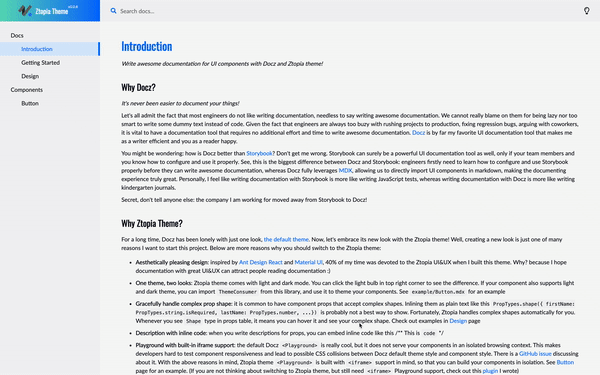

# Docz Theme Ztopia

Documentation can be found on the home page here: http://docz-theme-ztopia.surge.sh

Note: this project currently only works for Docz v1. Integration with Docz v2 is in progress :)
